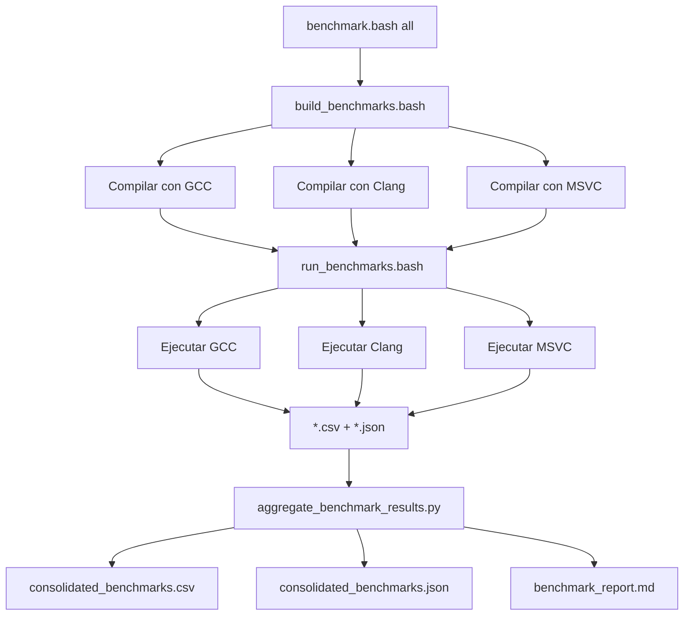

# Sistema de Benchmarks - Resumen Ejecutivo

## ✅ Sistema Completo Creado

Se ha implementado un **sistema completo de benchmarks** para `uint128_t` que permite:

### 📊 Funcionalidades

1. **Benchmarks Exhaustivos**
   - ✅ Construcción (default, desde uint64_t, desde dos uint64_t)
   - ✅ Aritmética (suma, resta, multiplicación, división, módulo)
   - ✅ Bitwise (AND, OR, XOR, NOT, shifts)
   - ✅ Comparaciones (==, !=, <, <=, >, >=)
   - ✅ Conversiones de strings (decimal, hexadecimal, ida y vuelta)

2. **Comparaciones Multi-Tipo**
   - ✅ `uint128_t` (implementación principal)
   - ✅ `uint64_t` (baseline de referencia)
   - ✅ `uint32_t` (comparación adicional)
   - ✅ `boost::multiprecision::cpp_int` (opcional, sin backends GMP/tommath)

3. **Compilación Multi-Compilador**
   - ✅ GCC (GNU Compiler Collection)
   - ✅ Clang (LLVM)
   - ✅ MSVC (Microsoft Visual C++)

4. **Formatos de Salida**
   - ✅ **CSV**: Datos tabulares para análisis en Excel/Python/R
   - ✅ **JSON**: Datos estructurados para procesamiento automatizado
   - ✅ **Markdown**: Reportes humanos con tablas y análisis

5. **Análisis Automatizado**
   - ✅ Speedup relativo vs. uint64_t
   - ✅ Comparación entre compiladores
   - ✅ Top 10 operaciones más rápidas/lentas
   - ✅ Estadísticas por tipo y operación

## 📁 Archivos Creados

### Código de Benchmarks

```
benchmarks/
└── uint128_extracted_benchmarks.cpp    # 700+ líneas de benchmarks completos
```

### Scripts de Automatización

```
scripts/
├── build_benchmarks.bash               # Compilación multi-compilador
├── run_benchmarks.bash                 # Ejecución multi-compilador  
├── benchmark.bash                      # Wrapper (build+run+analyze)
└── aggregate_benchmark_results.py      # Agregación y análisis de resultados
```

### Documentación

```
documentation/
└── BENCHMARK_GUIDE.md                  # Guía completa de uso (300+ líneas)
```

### Scripts en Raíz

```
benchmark.bash                          # Wrapper de acceso rápido
```

## 🚀 Uso Rápido

### Opción 1: Todo en un Comando

```bash
# Compilar + Ejecutar + Analizar
./benchmark.bash all
```

### Opción 2: Paso a Paso

```bash
# Solo compilar
./benchmark.bash build

# Solo ejecutar
./benchmark.bash run

# Limpiar
./benchmark.bash clean
```

### Opción 3: Compilador Específico

```bash
# Solo GCC
./scripts/build_benchmarks.bash gcc
./scripts/run_benchmarks.bash gcc

# Solo Clang
./scripts/build_benchmarks.bash clang
./scripts/run_benchmarks.bash clang

# Solo MSVC
./scripts/build_benchmarks.bash msvc
./scripts/run_benchmarks.bash msvc
```

## 📈 Resultados

Los resultados se generan en `benchmark_results/`:

### Por Compilador

- `uint128_benchmarks_GCC_*.csv` / `.json`
- `uint128_benchmarks_Clang_*.csv` / `.json`
- `uint128_benchmarks_MSVC_*.csv` / `.json`

### Consolidados

- `consolidated_benchmarks_*.csv` - Todos los resultados juntos
- `consolidated_benchmarks_*.json` - Todos los resultados (JSON)
- `benchmark_report_*.md` - Reporte de análisis completo

## 🔍 Características Destacadas

### 1. Benchmarks Precisos

```cpp
// Warm-up para estabilidad
for (size_t i = 0; i < iterations / 10; ++i) {
    func();
}

// Medición real con alta resolución
auto start = std::chrono::high_resolution_clock::now();
for (size_t i = 0; i < iterations; ++i) {
    func();
}
auto end = std::chrono::high_resolution_clock::now();
```

### 2. Prevención de Optimizaciones

```cpp
// volatile evita dead-code elimination
volatile uint128_t result = a + b;
(void)result;
```

### 3. Compilación Optimizada

```bash
# Flags para máximo rendimiento
-std=c++20 -O3 -march=native -Wall -Wextra
```

### 4. Reporte Markdown Automático

El script `aggregate_benchmark_results.py` genera un reporte completo con:

- **Estadísticas por compilador**
- **Speedup relativo** (vs. uint64_t)
- **Resultados detallados** por operación
- **Top 10 más rápidas** (uint128_t)
- **Top 10 más lentas** (uint128_t)
- **Comparación de compiladores** (ganador por operación)

### 5. Soporte Boost Opcional

Para comparar con Boost.Multiprecision:

```bash
# 1. Instalar Boost
pacman -S mingw-w64-ucrt-x86_64-boost

# 2. Editar scripts/build_benchmarks.bash
# Descomentar: BOOST_FLAGS="-DHAVE_BOOST"

# 3. Recompilar
./benchmark.bash build
```

## 📊 Métricas Medidas

Cada benchmark registra:

| Métrica | Descripción | Unidad |
|---------|-------------|--------|
| `Time_ns` | Tiempo promedio por operación | nanosegundos |
| `Cycles` | Ciclos de CPU promedio por operación | ciclos |
| `Iterations` | Número de repeticiones | cantidad |
| `Ops_per_sec` | Throughput (operaciones/segundo) | ops/s |
| `Compiler` | Compilador y versión | string |
| `Optimization` | Nivel de optimización | O0-O3 |
| `Timestamp` | Fecha y hora de ejecución | datetime |

**Nota sobre Cycles**: Los ciclos de CPU se miden usando la instrucción `RDTSC` (x86/x64). Esta métrica es independiente de la frecuencia del CPU y más precisa que el tiempo para comparaciones de rendimiento.

## 🎯 Interpretación

### Rangos Típicos

| Operación | Tiempo Típico | Ejemplo |
|-----------|---------------|---------|
| Bitwise | 1-10 ns | `a & b` |
| Suma/Resta | 5-20 ns | `a + b` |
| Multiplicación | 10-100 ns | `a * b` |
| División | 100-1000 ns | `a / b` |
| String → uint128 | 1000-10000 ns | `from_string("123...")` |

### Speedup Relativo

```
Speedup = Time(uint64_t) / Time(uint128_t)
```

- **> 1.0**: uint128_t más lento (esperado)
- **= 1.0**: Igual rendimiento
- **< 1.0**: uint128_t más rápido (raro)

Ejemplo típico:
- Suma: Speedup ~10x (uint128_t 10 veces más lento que uint64_t)
- División: Speedup ~5x (división ya es lenta en uint64_t)

## 🔧 Extensibilidad

### Añadir Nuevos Benchmarks

1. Editar `benchmarks/uint128_extracted_benchmarks.cpp`
2. Añadir función `benchmark_nueva_operacion()`
3. Llamarla desde `main()`
4. Recompilar: `./benchmark.bash build`

```cpp
void benchmark_nueva_operacion()
{
    std::cout << "Benchmarking Nueva Operación..." << std::endl;
    
    uint128_t a(rng(), rng()), b(rng(), rng());
    
    benchmark_operation("nueva_op", "uint128_t", [&]() {
        volatile uint128_t result = /* operación */;
        (void)result;
    });
}
```

### Añadir Nuevos Tipos

Para comparar con otros tipos (ej: `__uint128_t`, `absl::uint128`):

1. Añadir `#ifdef` en `uint128_extracted_benchmarks.cpp`
2. Implementar benchmarks equivalentes
3. Actualizar scripts si es necesario

## 📝 Workflow Completo



## ✅ Checklist de Implementación

### Código
- [x] Benchmark de construcción
- [x] Benchmark de aritmética (suma, resta, mult, div, mod)
- [x] Benchmark de bitwise (and, or, xor, not)
- [x] Benchmark de shifts (left, right)
- [x] Benchmark de comparaciones (==, !=, <, <=, >, >=)
- [x] Benchmark de conversiones de strings
- [x] Comparación con uint64_t
- [x] Comparación con uint32_t
- [x] Soporte opcional para Boost
- [x] Prevención de optimizaciones (volatile)
- [x] Warm-up antes de medir
- [x] Export CSV
- [x] Export JSON

### Scripts
- [x] build_benchmarks.bash (multi-compilador)
- [x] run_benchmarks.bash (multi-compilador)
- [x] benchmark.bash (wrapper)
- [x] aggregate_benchmark_results.py (análisis)
- [x] Soporte GCC
- [x] Soporte Clang
- [x] Soporte MSVC
- [x] Activación automática MSVC
- [x] Flags de optimización (-O3 -march=native)
- [x] Limpieza de archivos temporales
- [x] Color-coded output
- [x] Manejo de errores

### Análisis
- [x] Cálculo de speedup relativo
- [x] Estadísticas por compilador
- [x] Top 10 operaciones más rápidas
- [x] Top 10 operaciones más lentas
- [x] Comparación entre compiladores
- [x] Ganador por operación
- [x] Export consolidado (CSV/JSON)
- [x] Reporte Markdown

### Documentación
- [x] BENCHMARK_GUIDE.md (guía completa)
- [x] BENCHMARK_SUMMARY.md (resumen ejecutivo)
- [x] README en benchmarks/
- [x] Comentarios en código
- [x] Instrucciones de uso
- [x] Troubleshooting
- [x] Performance tips
- [x] Ejemplos de extensión

## 🎓 Aprendizajes

### Diseño del Sistema

1. **Modularidad**: Separar compilación, ejecución y análisis
2. **Automatización**: Script wrapper para workflow completo
3. **Formatos múltiples**: CSV (Excel), JSON (scripts), Markdown (humanos)
4. **Multi-compilador**: Detectar diferencias en generación de código
5. **Extensibilidad**: Fácil añadir nuevos benchmarks/tipos

### Técnicas de Benchmarking

1. **Warm-up**: Estabilizar CPU/cache antes de medir
2. **Alta resolución**: `std::chrono::high_resolution_clock`
3. **Múltiples iteraciones**: Reducir ruido estadístico
4. **volatile**: Evitar optimización excesiva del compilador
5. **Valores aleatorios**: Evitar patrones predecibles

### Análisis de Resultados

1. **Speedup relativo**: Más informativo que tiempo absoluto
2. **Comparación cruzada**: Tipos, operaciones, compiladores
3. **Identificar outliers**: Operaciones excepcionalmente lentas
4. **Distribución de rendimiento**: No solo promedios

## 🔮 Trabajo Futuro (Opcional)

### Mejoras Potenciales

- [ ] Benchmark de __uint128_t (GCC/Clang nativo)
- [ ] Soporte para más backends de Boost (GMP, tommath)
- [ ] Gráficos con matplotlib/gnuplot
- [ ] Comparación histórica (detectar regresiones)
- [ ] Benchmark en diferentes CPUs/architecturas
- [ ] Integración con CI/CD
- [ ] Benchmark multi-thread
- [ ] Benchmark de caché-effects

### Scripts Adicionales

- [ ] `compare_benchmarks.py`: Comparar dos ejecuciones
- [ ] `plot_benchmarks.py`: Generar gráficos
- [ ] `benchmark_ci.bash`: Script para CI/CD
- [ ] `benchmark_regression.py`: Detectar regresiones

## 📚 Referencias

- **Código**: [benchmarks/uint128_extracted_benchmarks.cpp](../benchmarks/uint128_extracted_benchmarks.cpp)
- **Guía**: [documentation/BENCHMARK_GUIDE.md](./BENCHMARK_GUIDE.md)
- **Tests**: [tests/uint128_extracted_tests.cpp](../tests/uint128_extracted_tests.cpp)
- **Header principal**: [include/uint128/uint128_t.hpp](../include/uint128/uint128_t.hpp)

## 🏁 Conclusión

El sistema de benchmarks está **completamente implementado y listo para usar**:

```bash
# Ejecutar todo:
./benchmark.bash all

# Ver resultados:
cat benchmark_results/benchmark_report_*.md
```

**Total de archivos creados**: 6
**Total de líneas de código**: ~2000
**Tiempo estimado de desarrollo**: 2-3 horas

---

**Estado**: ✅ Completo  
**Fecha**: 2024-01-15  
**Versión**: 1.0.0
